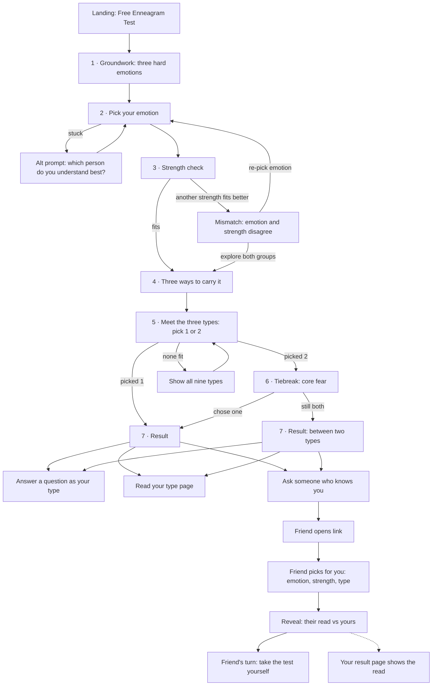

<!-- docs/taskers/T-42-assets/user-flow.md -->

# T-42 user flow: the 9takes Enneagram test

**Status:** Draft flow, built from DJ's spoken process on 2026-10-06. Copy is a first draft for DJ to edit; the structure and the four decisions below are DJ's.
**Parent:** `docs/taskers/T-42-scored-enneagram-test.md`
**Prototype:** https://claude.ai/artifact/D7txmWh3hqBDAjs8CWWBn3 (private, clickable, 2026-10-06). It uses this doc's copy. If the two disagree, this doc wins.

---

## 1. The idea in one paragraph

The test walks a stranger through the same conversation DJ has when someone asks how to find their type. It starts with emotion, not behavior. Three hard emotions shape personality (anger, shame, fear). You pick the one that shows up most for you. Each emotion comes with a strength (instinct, emotional intelligence, intellect), and that strength confirms the pick. Three types share each emotion, and what separates them is what they do with it: use it, push it down, or not notice it. You read three type cards and pick the one or two that sound like you. If you pick two, the core fear breaks the tie. If you're still torn, you ask someone who knows you, and the test gives you a link to send them. The result is one type or two, never a score sheet.

## 2. DJ's decisions (2026-10-06)

| Fork                                               | Decision                                                                                                                                                    |
| -------------------------------------------------- | ----------------------------------------------------------------------------------------------------------------------------------------------------------- |
| How each triad's three types relate to the emotion | **Uses it:** 8, 4, 6. **Pushes it down:** 1, 2, 7. **Unaware of it:** 9, 3, 5.                                                                              |
| How people choose at each step                     | **Pure self-pick.** No rated statements and no percentages. People read and choose, the way DJ does it in conversation.                                     |
| "Ask someone who knows you"                        | **Friend link.** The friend answers the same questions about the test-taker before seeing the test-taker's pick. Both see the comparison.                   |
| Where the test ends                                | **Three exits, all on the result screen:** answer a question as your type, read your type page, send the friend link ("these are my results, is this me?"). |

## 3. Flow map

## 4. Screen by screen

Time budget: 5 to 10 minutes. Most of it is reading. There are 5 required taps, plus up to 2 more if you tiebreak.

### Landing (`/enneagram-test`)

- **Job:** tell a search visitor this is a real, free test, then start it. Everything above the Start button is server-rendered (T-42 done-criterion 2).
- **H1:** "Free Enneagram Test"
- **Sub:** "Start with the emotion, not the behavior. About 5 to 10 minutes. No email, and your result shows on screen."
- **Three facts under the button:** Free · No email wall · Ends with 1 or 2 types, not a score sheet
- **Below the fold (SEO body):** how the test works (the four steps in plain language), what a self-report test can and can't tell you, a link to the comparison post ("Want to compare free tests? Here's our honest list, ours included"), and the nine type cards linking to type pages.
- **Decision (mine, veto-able):** the current page's thesis line, "A quiz can only score the person you decided to be for five minutes", goes. It argues against the thing we're now offering. The idea that you recognize your type and nobody assigns it stays, and that's what the pick-and-confirm steps do.

### 1 · Groundwork (one screen)

- **Job:** the setup DJ always gives before typing anyone.
- **Copy:**
  - "Your personality is built around an emotion."
  - "When people talk about what shaped them, they usually point to something hard, not something easy. The Enneagram starts there. There are three hard emotions: anger, shame and fear. You develop a complicated relationship with one of them, and your personality forms around handling it."
  - "Most other hard feelings are versions of these three." Show each word family (see §6).
  - "Everyone feels all three. One of them shows up more than the others. That's the one we're looking for."
- **Action:** "Got it"
- **Guardrail:** the origin claim is hedged ("they usually point to"). Per the 2026-07-15 do-not-write list, never state childhood or trauma as a certain cause.

### 2 · Pick your emotion

- **Prompt:** "Which one shows up for you most in a normal week?"
- **Three cards.** Each has the emotion, its word family, and one line for the type in that triad who doesn't notice the emotion (see §6). That line is the safety net for 9s, 3s and 5s, who often don't recognize their own emotion. It keeps the step a pure self-pick and still gives those three a way in.
- **If stuck:** a "Hard to say?" link swaps in DJ's alternate question: "Which person do you understand best without trying: the one who's fed up, the one who feels not good enough, or the one who's scared?" The same three cards are reworded around that person.
- **Action:** tap one card. No multi-select here. The strength step handles ties.

### 3 · Strength check

- **Job:** confirm the emotion with its strength.
- **Copy:** "Hard feelings build coping skills, and those skills become strengths. [Fear] usually comes with this one:" then the strength card for the chosen emotion (see §6).
- **Actions:** "Yes, that's me" → step 4. "Another one fits better" → show the other two strengths and let them pick.
- **Mismatch branch:** if the strength they pick belongs to a different emotion, show: "Your emotion and your strength point different ways. That's common. It often means the emotion that runs you is the one you notice least." Then two choices:
  - "Re-pick my emotion" → step 2
  - "Show me both groups" → steps 4 and 5 run with six type cards, grouped by emotion

### 4 · Three ways to carry it (explainer)

- **Copy:** "Three types share [fear]. What separates them is what they do with it."
  - **Use it.** "It gives you energy. It gets you moving."
  - **Push it down.** "You feel it and shove it away. 'Not right now.'"
  - **Don't notice it.** "It runs in the background and steers you without asking."
- Each line names its type for this emotion (for example, fear: 6 uses it, 7 pushes it down, 5 doesn't notice it).
- **Action:** "Meet the three"

### 5 · Meet the three (pick 1 or 2)

- **Prompt:** "Pick the one that sounds most like you. If two do, pick both."
- **Three cards** (six in both-groups mode). Each card has: number and name, how this type carries the emotion, core fear, what they're chasing, three patterns, their strength, and "you might say." Full copy in §6.
- **Actions:** tap to select (max 2), then "Continue." A "None of these" link opens all nine cards with the same 1-or-2 pick.
- **Branch:** one pick → result. Two picks → tiebreak.

### 6 · Tiebreak (only if two picked)

- **Job:** DJ's move: "Go back to the core fear."
- **Prompt:** "Go back to the root. Which of these fears would actually wreck your week?"
- **Two cards, side by side:** each type's core fear and what it's chasing. Nothing else, so the fear does the work.
- **Actions:** pick one → single result. "Honestly, both" → two-type result.

### 7 · Result

- **Headline:** "You're most likely a 6." or "You're between a 5 and a 6."
- **The read back:** your emotion, how you carry it, your strength, your core fear, in one short block. It's their own picks played back in DJ's language.
- **Honesty line:** "This test doesn't measure you. It walks you through how to recognize your type. People sometimes pick who they want to be, which is why the best check is someone who knows you."
- **Three exits** (DJ's list). The order is fixed. On a two-type result, the friend link moves to first.
  1. **Answer a question as a [6].** "Answer before the crowd, then see how 6s and the other eight answered." Opens one live give-first question picked for that type. Flagged questions are excluded (T-42 constraint).
  2. **Read the Type 6 page.** Links to `/enneagram-corner/enneagram-type-6`.
  3. **Ask someone who knows you.** Opens the invite sheet (§5).
- **After the exits (optional, never a gate):** "Email me when someone answers my link." This is the only email ask in the whole flow, and it only appears after the result.
- **Result URL:** each result gets a private, unguessable URL (noindex) so people can come back and see friend reads. There's no public share card in v1; the friend link is the share mechanic.

## 5. The friend link

### Test-taker side (invite sheet)

- **Fields:** "What should they call you?" (optional, defaults to "your friend"). The message is pre-filled and editable:
  - One type: "I took an Enneagram test and it says I'm a 6. I want an outside read before I believe it. Takes 3 minutes, and you answer before you see my pick: [link]"
  - Two types: "I took an Enneagram test and I'm stuck between a 5 and a 6. Which am I? Takes 3 minutes, and you answer before you see my pick: [link]"
- **Send options:** Copy link · Text · Email. Copy is the primary button because it works everywhere.
- **One link, many people.** The same link can go to a parent, a partner and a friend. Each read shows up separately.

### Friend side (`/enneagram-test/read/[token]`, noindex)

1. **Landing:** "[Jordan] wants your honest read." / "3 minutes. You answer before you see what Jordan picked." (This is the product ritual, answer before the crowd, applied to a person.)
2. **Emotion:** "Which of these shows up most in Jordan?" Same three cards, written in the third person.
3. **Strength:** "Which strength is most Jordan?" There's no mismatch branch for the friend. They pick, and we move on.
4. **Type:** the three cards for the emotion they picked, written in the third person, pick one. "None of these" opens all nine.
5. **Optional note:** "Want to say why? (Jordan will see this)." One line, skippable. It gives the two of them something to talk about, which is the conversation DJ wants to start.
6. **Reveal:** "You said 6. Jordan said 5 or 6." Then one of three lines: a match ("You see Jordan the way Jordan sees Jordan."), a partial match ("You picked one of Jordan's two."), or a miss ("You see Jordan differently than Jordan does. That's the conversation worth having.").
7. **Friend's next step:** "Now find yours" (start the test, the main conversion) · "See how 6s answer real questions."

### What the test-taker sees

- On their result URL: a "Reads from people who know you" section. The empty state reads "No reads yet. Send your link." Each read shows the friend's chosen name, their pick and their note.
- If they opted in to the email: "Mom read you as a 6. See what they said."

## 6. Draft copy bank

### Emotions (step 2)

| Emotion | Word family                                                           | Line for the type who doesn't notice it                                                 |
| ------- | --------------------------------------------------------------------- | --------------------------------------------------------------------------------------- |
| Anger   | frustrated · resentful · irritated · impatient · pissed off           | "Or you rarely get angry, but you go numb, go along, or quietly dig in."                |
| Shame   | insecure · less than · not good enough · on the outside · embarrassed | "Or you don't feel insecure. You just stay busy proving yourself."                      |
| Fear    | anxious · worried · stressed · on edge · overwhelmed                  | "Or you wouldn't call it fear. You just pull back into your head and save your energy." |

Alternate prompt (empathy version): anger → "the one who's fed up"; shame → "the one who feels not good enough"; fear → "the one who's scared of what's coming."

### Strengths (step 3)

| Emotion | Strength               | Card copy                                                                       |
| ------- | ---------------------- | ------------------------------------------------------------------------------- |
| Anger   | Instinct               | "You go with your gut. You feel what's right in your body and act on it."       |
| Shame   | Emotional intelligence | "You read people. You pick up what someone feels, often before they do."        |
| Fear    | Intellect              | "You think it through. You plan, analyze, and spot problems and options early." |

### The nine type cards (step 5)

**8 · The Challenger** (anger, uses it)

- Carries it: "Anger is fuel. You feel it fast, say it out loud, and act on it. It's how you protect yourself and the people you love."
- Core fear: being controlled, harmed, or at someone else's mercy
- Chasing: staying in control of your own life
- Patterns: you'd rather be respected than liked · you push to find out what people are made of · showing soft spots feels dangerous
- Strength: instinct for power. You read who's really in charge and move first.
- You might say: "Just tell me straight."

**1 · The Perfectionist** (anger, pushes it down)

- Carries it: "You feel anger, but showing it doesn't feel right. So it leaks out as correcting, criticizing, and 'I'm not mad, I'm frustrated.'"
- Core fear: being wrong, bad, or corrupt
- Chasing: being good and doing it right
- Patterns: you spot the mistake before anything else · your inner critic grades you hardest · "good enough" feels like giving up
- Strength: instinct for right and wrong. You sense what's off and how to fix it.
- You might say: "It's not about me. It's just not right."

**9 · The Peacemaker** (anger, doesn't notice it)

- Carries it: "You rarely feel angry. It stays underneath and shows up as going numb, going along, digging in your heels, or putting off what you want."
- Core fear: conflict, and losing connection with the people around you
- Chasing: peace, inside and out
- Patterns: you see everyone's side, sometimes except your own · conflict makes your body tense up · "I'm good with whatever," even when you aren't
- Strength: instinct for harmony. You feel what a group needs to get along.
- You might say: "I'm fine with whatever."

**4 · The Individualist** (shame, uses it)

- Carries it: "The 'something is missing in me' feeling sits front and center. You feel it fully and turn it into depth, expression and identity."
- Core fear: having no real identity, or being ordinary
- Chasing: being fully, uniquely yourself
- Patterns: you feel things other people don't have names for · ordinary feels like a slow death · you compare and come up missing something
- Strength: emotional depth. You can sit with feelings other people run from.
- You might say: "Nobody really gets it."

**2 · The Helper** (shame, pushes it down)

- Carries it: "You feel 'I'm not enough' and push it away by focusing on other people. Being needed keeps it quiet. Your own needs get filed under later."
- Core fear: being unwanted or unloved
- Chasing: being loved and needed
- Patterns: you know what someone needs before they ask · receiving help feels awkward · you give until you're empty, then feel unappreciated
- Strength: reading needs. You notice what someone feels before they say it.
- You might say: "Don't worry about me."

**3 · The Achiever** (shame, doesn't notice it)

- Carries it: "You don't feel insecure. You feel busy. The shame runs in the background and keeps you proving, performing and winning."
- Core fear: being worthless without your accomplishments
- Chasing: being valued and admired
- Patterns: you become whoever the room rewards · stillness makes you restless · failing feels like an identity problem, not a bad day
- Strength: reading the room. You know what will land and adjust in real time.
- You might say: "What's next?"

**6 · The Loyalist** (fear, uses it)

- Carries it: "You feel the fear and put it to work: preparing, scanning for problems, testing who you can trust. Worry is how you stay safe."
- Core fear: being without support or guidance when it counts
- Chasing: security, and people you can count on
- Patterns: you see what could go wrong before anyone else · you trust slowly, then stay loyal for life · you argue with your own decisions
- Strength: troubleshooting. You think through the worst case so nobody gets blindsided.
- You might say: "But what if...?"

**7 · The Enthusiast** (fear, pushes it down)

- Carries it: "You feel the fear and go 'not now.' You reframe it, plan the next good thing, and keep your options open so nothing can trap you."
- Core fear: being trapped in pain, or missing out
- Chasing: freedom and satisfaction
- Patterns: you plan tomorrow while today is happening · bad feelings get reframed fast · boredom feels like a threat
- Strength: possibilities. You connect ideas and see options other people miss.
- You might say: "Let's keep our options open."

**5 · The Investigator** (fear, doesn't notice it)

- Carries it: "You wouldn't call it fear. It runs in the background and pulls you into your head: save your energy, learn more, get ready before you engage."
- Core fear: being helpless, incapable, or overwhelmed
- Chasing: being capable and understanding how things work
- Patterns: people drain you, even ones you love · you want to understand before you take part · privacy is oxygen
- Strength: understanding. You dig until you know how it really works.
- You might say: "I need to think about it."

## 7. Decisions I made (veto any of them)

1. **The emotion step is single-select, and the strength step catches ties.** Allowing two emotions up front would double the reading for everyone. The mismatch branch handles people who are genuinely split.
2. **The "doesn't notice it" line sits on each emotion card.** This is DJ's third relationship, used early. Without it, 9s pick fear or shame and never see their own card.
3. **No wings, instincts or arrows in the result.** DJ's flow ends at "one or two types." The type page covers wings.
4. **The friend answers before seeing the test-taker's pick.** It keeps the friend's read honest and it's the product ritual. The comparison only means something if the friend wasn't anchored.
5. **Email appears once, after the result, and only to get notified about friend reads.** It's never needed to see a result (T-42 constraint).
6. **Progress saves in the browser,** so a refresh or a back tap doesn't lose your place. Nothing is stored on the server until the result screen.
7. **The existing reframe page is replaced, not kept beside the test.** See Landing.

## 8. Risks to know about

- **List inclusion with self-pick.** The result is a real typed outcome, it's free, it takes 5 to 10 minutes and there's no email wall. That meets Simply.Coach's stated criteria. Some roundups may still only list tests built from rated statements. The pitch angle is the friend check, which no listed test has. Read the "Get listed" replies before assuming either way.
- **The CTA copy.** `TestYourTypeCTA` promises "returns your dominant pattern with confidence scores." Self-pick has no confidence scores, so the copy changes at launch (T-42 done-criterion 4). Suggested: "Take the free 9takes Enneagram test. 5 to 10 minutes, no email, and a friend can check your result."
- **Self-flattering picks.** Pure self-pick lets people choose the card they like best. The honesty line and the friend link are the counterweight, so the friend link has to be prominent on the result screen, not buried.

## 9. What to measure

Events go through the existing tracking path (PostHog plus the in-house analytics). None of them carries answers tied to an identity.

| Event                                                                  | When                                  |
| ---------------------------------------------------------------------- | ------------------------------------- |
| `test_started`                                                         | Tap Start on the landing              |
| `test_step_completed` (step)                                           | Each step done                        |
| `test_emotion_alt_used`                                                | They opened the "Hard to say?" prompt |
| `test_strength_mismatch` (path: repick / both)                         | Mismatch branch taken                 |
| `test_none_fit`                                                        | "None of these" tapped                |
| `test_tiebreak` (outcome: one / both)                                  | Tiebreak resolved                     |
| `test_result_shown` (types, single/split)                              | Result rendered                       |
| `test_exit_clicked` (question / type_page / friend)                    | One of the three exits                |
| `friend_link_created` / `friend_link_opened` / `friend_read_submitted` | Friend loop                           |
| `friend_started_own_test`                                              | Friend tapped "Now find yours"        |

**The funnel that matters:** started → result → any exit, and friend link created → friend read submitted → friend started own test. That last number is the viral coefficient of the test.

## 10. Build notes (for whoever implements)

- `/enneagram-test` keeps its URL. The landing and SEO body are SSR. The test steps are a client-side state machine on the same page, so there's no navigation between steps.
- Content (§6) lives in one typed data module, so copy edits don't touch components.
- New tables: `test_results` (private token, picked types, path flags, no identity required) and `test_friend_reads` (result id, friend display name, picks, note). Rate-limit friend reads per token through `apiRateLimit.ts`.
- Result and friend routes are `noindex`.
- The question for exit 1 comes from a per-type list DJ curates. Fallback: the most-answered unflagged question that has nine takes.
