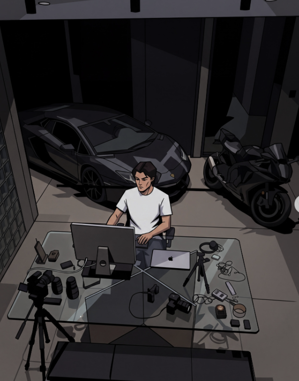
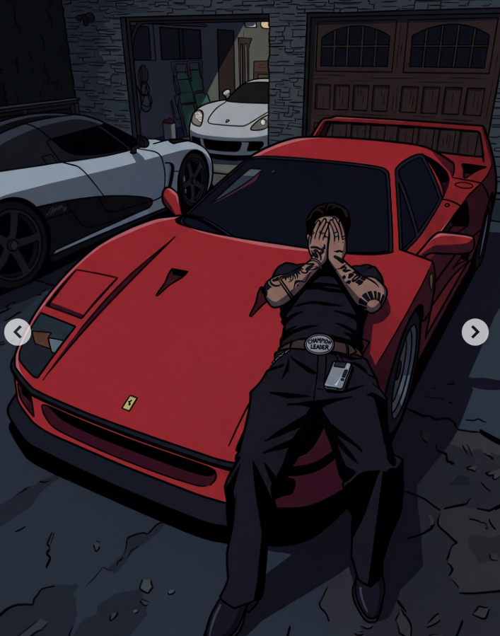

<!-- docs/visual-style/cel-shaded-neo-noir/cel-shaded-neo-noir-guide.md -->

# Cel Shaded Neo Noir Image Generation Guide

This guide defines a cinematic illustration aesthetic: clean black contours, angular cel shading, deep cool shadows, muted surroundings, and carefully placed rich color. Use it as a standing reference when generating new images. Preserve the visual treatment while changing the subject, setting, and story.

The working style name is **cel-shaded neo-noir illustration**. The appearance recalls GTA loading-screen illustrations and dark Western animated drama. These are visual comparisons, not claims about the reference artist's influences or production method. **Urban luxury noir** describes the mood of the original examples; luxury objects are optional.

## How to use this guide

Attach this document to an image-generation request, or paste the master style prompt alongside your scene description. For example:

> Use the attached Cel Shaded Neo Noir Image Generation Guide as the visual reference. Create a single image of [subject] in [setting], doing [action]. Use [camera angle and framing], [main light source], and [accent color]. The mood is [emotion]. Output [aspect ratio]. Apply the guide's drawing, shading, color, and lighting rules. Let this scene description determine the content.

For the closest visual match, also attach one of the reference images below. Some tools read document text without extracting embedded images. In a new conversation, attach the guide again unless the tool already has access to it.

## Visual references

**Garage workspace.** Study the overhead perspective, gray-white shirt, angular reflections, hard cast shadows, and large dark shapes around the vehicles. The figure remains readable even though most of the scene is subdued.

**Red car scene.** Study the rich red focal area against blue-gray pavement and near-black clothing. The car and figure have simplified tonal planes with strong contours. Red is comparatively saturated, but still belongs to a dark scene.

Reference source: [moodnotdead Instagram carousel](https://www.instagram.com/p/DcNpsjJkZ1V/). The guide also draws on the supplied screenshot of the account's image grid. Reference images are included to explain the visual treatment; new images should use the requested composition and subject.

## Drawing and rendering

### Contours and shapes

Use clean, confident black or near-black outlines. Give outer silhouettes more weight than interior details. Simplify complex forms into readable, slightly angular shapes. Keep perspective coherent and the subject recognizable. A vector-like finish describes the edge quality; either raster or vector tools can produce it.

People have stylized realistic proportions, simplified facial planes, and expressive silhouettes. Preserve individual features, skin tone, and body type when supplied. Use deliberate poses and readable hands. Cars, furniture, architecture, and devices can have more structural detail than faces.

### Cel shading

Build most surfaces from a base color, one substantial shadow shape, and an optional highlight. Cel shading means the transitions between these tones have distinct edges. Cast shadows and folds form graphic shapes; avoid smoothing every transition into a gradient.

Use broad dark masses beneath vehicles, inside rooms, behind figures, and in clothing folds. Add only enough small detail to identify materials and objects. Reflections should usually appear as angular bands or patches. Reserve soft gradients for isolated light effects such as a glowing screen or lamp.

### Lighting and readability

Choose one dominant light source and let it explain the shadows. Secondary light can be subtle. Overhead garage lights, a window, a streetlamp, or a warm doorway all fit the aesthetic. Keep the brightest areas small and purposeful.

Low-key lighting means most of the image occupies darker values. Preserve enough separation to read faces, hands, silhouettes, and important props. Let unimportant background areas merge into darkness. If the result looks muddy, lighten the focal subject or separate adjacent dark tones before lifting the entire image.

Cool blue-gray or violet-gray shadows can sit against warmer skin and amber light. Match that temperature shift to the scene. Use pure black sparingly for the deepest shadows and linework. An indoor or daylight scene can retain the style through restrained brightness and strong shadow shapes.

## Color palette and materials

The palette below is a practical starting point, not an exact extraction from the screenshots. Hex values describe color direction; image generators may approximate them. Lighting and the relationship between colors matter more than exact codes.

| Color role             | Starting color  | Hex     | Typical use                           |
| ---------------------- | --------------- | ------- | ------------------------------------- |
| Ink and deepest shadow | Near-black      | #0C0D13 | Contours, occlusion, dark silhouettes |
| Cool shadow            | Midnight navy   | #191C2A | Clothing, interiors, night sky        |
| Cool midtone           | Slate blue-gray | #37424F | Pavement, architecture, metal         |
| Warm neutral           | Stone taupe     | #756B63 | Floors, walls, muted upholstery       |
| Light neutral          | Warm ivory      | #D4C7B6 | Small lit areas, fabric, paper        |
| Warm accent            | Muted amber     | #B18849 | Lamps, brass, jewelry                 |
| Main accent option     | Deep crimson    | #A92D3D | Car paint, fabric, a focal prop       |
| Alternate accent       | Electric blue   | #3457D5 | Screens and small light sources       |
| Alternate neutral      | Dark olive      | #434A39 | Foliage, felt, upholstery             |

### Distribute color deliberately

As a starting composition, let roughly 70 percent be dark neutrals, 25 percent be subdued midtones, and 5 percent be bright highlights or vivid accents. These are flexible design targets, not measurements of the references. A red car may occupy far more space while the background stays subdued.

Choose one main accent family per scene. A second accent should be smaller or quieter. Keep whites tinted by their surroundings rather than making every light object pure white. Let skin retain its natural range; use warm lit planes and cooler or deeper shadows without forcing every person into one palette color.

### Translate materials into a few clear marks

**Metal and car paint:** clean silhouettes, dark bases, crisp reflected shapes, and sparse bright edges. **Glass:** dark transparent planes and a few controlled reflections. **Fabric:** flat color masses with angular folds. **Skin:** simplified planes and restrained highlights. **Stone and wood:** subdued texture with selective lines. **Gold:** ochre and brown planes with small pale highlights.

## Composition and atmosphere

Compose a moment that feels observed: a person working late, a quiet interaction, a waiting figure, or an object left in a suggestive setting. The scene can feel reflective, intimate, tense, or self-possessed. Let posture, space, and lighting carry the emotion.

Use overhead views, three-quarter views, close crops, or an occasional tilted frame when they serve the scene. Establish depth with foreground objects, overlapping forms, and converging architectural lines. Keep one clear focal subject and organize secondary details around it. Avoid filling every available space.

The original examples use cars, jewelry, fashion, nightlife, and occasional pop-culture imagery. These subjects are optional. The same treatment can depict a library, kitchen, café, athlete, musician, workshop, or ordinary street. Add brands, lettering, and recognizable fictional characters only when the scene asks for them.

## Master style prompt

Copy this paragraph unchanged when consistency across images matters, then add your scene brief.

> Create a cinematic cel-shaded neo-noir illustration. Use clean black ink contours, slightly angular forms, stylized realistic proportions, and coherent perspective. Render most surfaces in two or three distinct tonal planes with crisp shadow edges. Establish large graphic shadow masses and sparse, intentional highlights. Use a low-key palette of charcoal, midnight navy, slate blue-gray, and muted earth tones, with natural skin tones and one controlled rich accent color. Keep the focal subject readable against the dark surroundings. Give metal, glass, and fabric simplified but convincing material cues. Use directional lighting, subtle warm and cool color contrast, and the composition of a candid film still. Maintain a clean illustrated finish with minimal surface texture. Limit soft blending to small light effects. Follow the scene brief for subjects, objects, setting, and framing.

### Scene brief template

- Subject and action: [who or what is shown and what is happening].
- Setting and key props: [place, time of day, and two or three meaningful details].
- Composition: [camera height, angle, crop, and placement of the focal subject].
- Lighting: [dominant source, direction, and warmth or coolness].
- Accent color: [one color and where it appears].
- Mood: [the feeling conveyed by the scene].
- Output: [aspect ratio and any intended text space].
- Required details: [identity, clothing, objects, exact lettering, or other constraints].

### Optional negative prompt

Use this as an avoid list if the tool supports negative prompts. Otherwise append a short sentence naming only the problems relevant to the result.

> Photorealistic rendering, glossy 3D cartoon surfaces, airbrushed shading across every object, painterly brushwork, sketchy contours, heavy crosshatching, halftone dots, exaggerated chibi proportions, oversized anime eyes, pastel candy palette, uniformly bright lighting, neon across the entire scene, excessive bloom, crushed unreadable subjects, arbitrary text, unrequested logos, watermarks.

## Example scene briefs

Append any of these to the master style prompt. Each can also be used with the attached guide.

### Late night workspace

> An adult designer sits at a glass desk inside a quiet industrial studio at night. Show a three-quarter overhead view, with the person in the middle distance and a camera and notebook in the foreground. A single overhead light illuminates the gray-white shirt, hands, and part of the desk. Large shelves recede into charcoal darkness. Slate blue-gray surroundings, one muted amber desk lamp, crisp cast shadows, angular glass reflections. Reflective and absorbed mood. Portrait 4:5 composition. No lettering.

### Rainy café portrait

> An adult woman in a dark coat sits alone beside a rain-streaked café window, one hand around a deep-crimson cup. Frame her from the waist up in a three-quarter view, with the window forming a strong diagonal behind her. Cool blue-gray exterior light meets a restrained warm pendant light on her face. Keep her features and skin tone natural, with simplified facial planes and distinct shadow edges. Let the far side of the café fall into deep navy. Quiet and thoughtful mood. Portrait 4:5 composition.

### Music studio scene

> Two adult musicians pause between takes in a small recording studio. View them from a slightly elevated corner, with a microphone stand in the foreground and a keyboard receding toward the back wall. One seated figure is the clear focal subject; the other remains partly in shadow. Use dark olive upholstery, charcoal clothing, warm skin, and a small electric-blue equipment display as the accent. A directional ceiling light creates angular shadows on the floor. Intimate, tired, focused mood. Landscape 16:9 composition.

## Keep a series consistent

Keep the master style prompt, outline weight, shadow hardness, tonal simplicity, and overall value range stable. Define recurring characters, wardrobe, architecture, and props separately from the style. Reuse the same reference image and approved generated example when your tool supports image references. Change the scene brief without rewriting the entire style description.

For a single-image revision, name what to preserve before describing the change. Example: "Preserve the composition, identity, linework, and hard cel shading. Darken the background into cool navy, retain readable facial planes, and make the cup the only strong crimson accent."

## Diagnose and refine an image

| If the result looks                   | Request this adjustment                                                                      |
| ------------------------------------- | -------------------------------------------------------------------------------------------- |
| Too photographic or three dimensional | Simplify surfaces into two or three flat tonal planes and strengthen illustrated contours.   |
| Too bright or cheerful                | Lower background values, subdue secondary colors, and reserve brightness for the focal area. |
| Too dark to read                      | Separate adjacent dark shapes and lift the face, hands, or subject edge selectively.         |
| Too soft or painterly                 | Sharpen shadow boundaries, remove broad airbrushing, and reduce surface texture.             |
| Too neon or cyberpunk                 | Confine saturated color to one focal area and restore neutral surroundings.                  |
| Too childish or exaggerated           | Use stylized realistic anatomy, smaller eyes, quieter expressions, and more grounded poses.  |
| Too cluttered                         | Remove secondary props, consolidate background shadows, and strengthen the focal silhouette. |

Before accepting an image, check that the focal subject reads at thumbnail size, contours stay crisp, shadow shapes feel intentional, accent colors remain controlled, and the composition communicates the requested mood. The style should remain recognizable when the scene contains no luxury objects.
